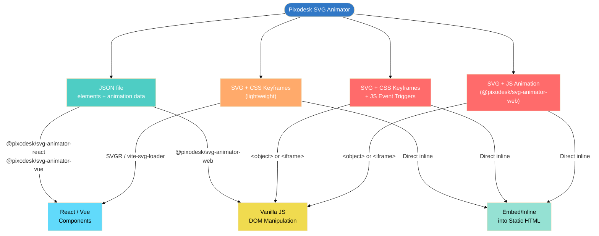

# pixodesk-svg-animator

[](https://github.com/pixodesk/pixodesk-svg-animator/actions/workflows/ci.yml)
[](https://opensource.org/licenses/MIT)

# 🚧 **Status - This project is currently under development.**


<!-- <video  src="boat.mp4" autoplay  muted loop playsinline style="width: 100%; height: auto; display: block;"></video> -->


This repository contains the official runtime libraries for playing SVG animations created with the [Pixodesk SVG Animation](https://pixodesk.com) editor.

**Common use cases:** 
- splash screens, 
- animated backgrounds, 
- icon animations, 
- loaders.


---

## File Formats created by [Pixodesk SVG Animation](https://pixodesk.com) editor

The Pixodesk editor supports animation in two formats: **SVG** and **JSON**.   
Those file formats are interchangeable — the editor can convert between them at any time.

## Pixodesk SVG Animator File Formats at a Glance

Two export formats:

- **JSON file** — the most flexible format. Animation data, structure, and metadata in a single file; JavaScript renders the DOM and drives the animation at runtime. Use with `@pixodesk/svg-animator-web`, `@pixodesk/svg-animator-react`, `@pixodesk/svg-animator-vue`.
- **SVG file** — a pre-rendered SVG with animation embedded directly in the file. Self-contained. Three flavors:
  - **SVG + CSS-Keyframes** — animation defined in a `<style>` block
    - *No `<script>` tag* — zero JavaScript
    - *With JS triggers* — adds a minimal `<script>` fragment to respond to events (click, hover, scroll)
  - **SVG + JavaScript animation** — `@pixodesk/svg-animator-web` bundled inside a `<script>` tag. Supports:
    - Web Animations API (WAAPI) — native browser animation
    - Animation frames (`requestAnimationFrame`) — universal browser support

---




## How to Choose Pixodesk SVG Animator File Format - JSON vs SVG

**Default to JSON.** Switch to **SVG** (which has some limitations) when you want to:
- **Reduce bundle size** — use CSS Keyframes for simple animations; no JavaScript library needed
- **Show content before JavaScript loads for static site generators** — SVG is pre-rendered and visible immediately
- **Minimize setup** — just inline/embed the file directly without extra setup

**More details**:

- **React / Vue / Next.js / Nuxt**
  - Use **JSON** — **SSR-safe**, integrates cleanly with framework components, avoids inline script restrictions. Full support of animation features. Use `@pixodesk/svg-animator-react` / `@pixodesk/svg-animator-vue`.
  - Use **SVG + CSS-Keyframes** (no JavaScript) — minimal setup; import the same way as SVG icons (e.g., via **SVGR** or **vite-svg-loader**), and it is **SSR-safe**. It has limitations in what it can animate and offers less control over animation behavior. However, it is sufficient for most use cases.
- **Vanilla JavaScript/DOM**, dynamic load.
  - Use **JSON** — dynamically load and instantiate an animator using `@pixodesk/svg-animator-web`. Full support of animation features.
  - Use **SVG** — with `<object data="animation.svg" ...` or `<iframe src="animation.svg" ...`. Not recommended.
- **Static site generators and CMS** (Astro, Jekyll, WordPress, Shopify, etc.)
  - Use **any SVG** — the build tool or CMS inlines the file at build time; even SVG with `<script>` tags will just work


### Format pros and cons

| File type | When to use | Advantages | Disadvantages |
|-----------|-------------|------------|---------------|
| **JSON file** | Complex animations (shape morph, sequencing) <br> Programmatic control needed <br> Multiple instances on the page <br> React / Vue / Next.js / Nuxt apps | Full animation support including all types <br> Fine-grained runtime control: play, pause, seek, reverse, speed <br> Clean independent rendering per instance — no ID conflicts <br> SSR-safe | Requires `@pixodesk/svg-animator-react`, `-vue`, or `-web` runtime <br> More setup: data file and rendering component must be wired together |
| **SVG** with <br> **CSS Keyframes** | Drop-in animated icon in React/Vue <br> Embedding via `` or inline HTML <br> Simple looping or entrance animations | No library payload — minimal file size <br> No `<script>` tag — embeds cleanly via ``, inline HTML, or SVGR <br> Works as a drop-in icon replacement | No shape morphing or physics-based animations <br> No runtime control (play, pause, seek) <br> Limited to what CSS `@keyframes` can express <br> Possible ID conflicts when the same SVG is embedded more than once |
| **SVG** with <br> **CSS Keyframes + JS triggers** | Static HTML pages with event-triggered start/stop (e.g. play on hover) | No library payload — minimal file size <br> Adds basic event-driven start/stop control | No shape morphing or advanced animation types <br> No precise runtime control (seek, reverse, speed) <br> `<script>` tag prevents embedding via SVGR or `` <br> Possible ID conflicts when the same SVG is embedded more than once |
| **SVG** with <br> **JavaScript animation** | Static or server-rendered pages <br> When content must appear before JS hydration <br> All animation types without a separate data file | Supports all animation types including shape morphing <br> Full runtime control: play, pause, seek, reverse, speed <br> Self-contained — no separate data file required | Adds `@pixodesk/svg-animator-web` library overhead <br> `<script>` tag prevents embedding via SVGR or `` <br> Possible ID conflicts when the same SVG is embedded more than once |

---

## Animation Type Support

| Animation Type | CSS Keyframes | Web Animation API <br> (JavaScript) | Animation Frames <br> (JavaScript) |
|----------------|---------------|--------------------------------------|-------------------------------------|
| **Simple Numeric** (opacity, stroke-width) | ✅ Full support | ✅ Full support | ✅ Full support |
| **Position Attributes** (x, y, cx, cy, r, rx, ry) | ❌ Not supported `????` | ✅ Full support | ✅ Full support |
| **Size Attributes** (width, height) | ❌ Not supported `????` | ✅ Full support | ✅ Full support |
| **Transform** (translate, rotate, scale, skew) | ✅ Full support | ✅ Full support | ✅ Full support |
| **Colors** (fill, stroke) | ✅ Full support | ✅ Full support | ✅ Full support |
| **Path Morphing** (d attribute) | ❌ Not supported | ❌ Not supported | ✅ Full support |
| **Stroke Dash** (stroke-dasharray, stroke-dashoffset) | ✅ Basic support | ✅ Full support | ✅ Full support |
| **Gradient Stop Points** (offset, stop-color) | ⚠️ Limited `????` | ⚠️ Limited `????` | ✅ Full support |
| **Filters** (blur, brightness, etc.) | ⚠️ Simple only `????` | ✅ Most filters | ✅ Full support |
| **Clip-path / Mask Morphing** | ❌ Not supported `????` | ❌ Not supported `????` | ✅ Full support |
| **Text on Path** (startOffset, textPath) | ⚠️ Limited `????` | ✅ Full support | ✅ Full support |
| **Performance** | ⚡ Excellent | ⚡ Excellent | ⚠️ Good |
| **Browser Support** | ✅ Universal | ✅ Modern browsers | ✅ Universal |


---


## File formats


### JSON File format overview

A JSON document that closely mirrors SVG structure, with animation keyframes and metadata embedded alongside element definitions. JavaScript constructs the DOM at runtime using a framework component or the runtime API.

```json
{
  "type": "svg",
  "viewBox": "0 0 400 400",
  "animator": {
    "duration": 1000,
    "iterations": "infinite",
    "mode": "auto",
    "trigger": { "startOn": "load" }
  },
  "children": [
    {
      "type": "ellipse",
      "fill": "#007fff85",
      "stroke": "#003a73",
      "transform": "translate(139.6604, 163.8499)",
      "animate": {
        "translate": {
          "keyframes": [
            { "t": 0, "v": [139.6604, 163.8499] },
            { "t": 1000, "v": [139.6604, 310.3879] }
          ]
        }
      },
      "rx": 64.0253,
      "ry": 64.0253
    }
  ]
}
```

### SVG File overview

A self-contained animated SVG — all shapes, styles, and animation logic are embedded directly in the file. No separate data file or rendering component is needed. Three flavors are available:

#### **CSS Keyframes**

Animation defined in a `<style>` block. No JavaScript, no `<script>` tag.

```svg
<svg xmlns="http://www.w3.org/2000/svg" viewBox="...">
  <style>
    @keyframes _px_2s602utm {
      0% { transform: translate(200.1185px, 41.3612px); }
      100% { transform: translate(200.1185px, 41.3612px); }
    }
  </style>
  <g class="px-anim-element _px_2s602utn" transform="...">
    <ellipse id="_px_2s602utl" fill="#0087ff" ... />
  </g>
</svg>
```

#### **CSS Keyframes + JavaScript triggers** 
Same as above, plus a small `<script>` fragment to start/stop the animation on events (click, hover, scroll).

```svg
<svg xmlns="http://www.w3.org/2000/svg" viewBox="...">
  <style>@keyframes ... { ... }</style>
  <g class="px-anim-element ...">...</g>
  <script data-px-script="true">
    /* Small fragment to control animation on events */
  </script>
</svg>
```

#### **JSON + JavaScript animation** 
Animation driven entirely by `@pixodesk/svg-animator-web`, bundled into a `<script>` tag. Supports all animation types including shape morphing. Uses the Web Animations API (WAAPI) or `requestAnimationFrame` under the hood.

```svg
<svg xmlns="http://www.w3.org/2000/svg" viewBox="...">
  <g id="_px_2s60omse" transform="translate(...)">
    <ellipse id="_px_2s60omsd" fill="#0087ff" ... />
  </g>
  <script data-px-script="true">
    var a = PixodeskAnimator.createAnimator({
      "defs": {
        "animations": {
          "0": { "translate": { "keyframes": [
            {"t": 0, "v": [200.1185, 41.3612], "e": [0.3333, ...]},
            {"t": 1000, "v": [200.1185, 41.3612]}
          ]}}
        },
        "bindings": [{"id": "_px_2s60omse", "animate": ...}]
      }
    });
  </script>
</svg>
```

---


## Using in React / Next.js

SVG files are self-contained and can be embedded in a few ways:

- **Copy-paste** — paste SVG markup directly into HTML
- **Inlined/embedded** - into static HTML by your framework, CMS or static site generator
- **`<object>` / `<iframe>`** — reference the `.svg` file by URL (animation runs in isolation)
- **Framework import** — let the build tool inline the SVG at build time (see below)

### React / Next.js

**CSS Keyframes SVG** — import as a component via [SVGR](https://react-svgr.com/), the same way you import an icon:

```tsx
// requires @svgr/webpack or @svgr/vite
import Animation from './animation.svg';
<Animation />
```

**SVG with `<script>`** — SVGR strips `<script>` tags by default. Use `dangerouslySetInnerHTML` or a raw HTML approach, or switch to JSON instead.

**JSON:**

```tsx
import { PixodeskSvgAnimator } from '@pixodesk/svg-animator-react';
import animation from './animation.json';

export default function App() {
  return <PixodeskSvgAnimator doc={animation} autoplay />;
}
```

## Using in Vue / Nuxt

**CSS Keyframes SVG:**

```vue
<component :is="require('./animation.svg?inline')" />
```

**JSON:**

```vue
<template>
  <PixodeskSvgAnimator :doc="animation" autoplay />
</template>

<script setup>
import { PixodeskSvgAnimator } from '@pixodesk/svg-animator-vue';
import animation from './animation.json';
</script>
```

## Vanilla JavaScript / DOM

**Package:** `@pixodesk/svg-animator-web`

**Option 1: Data attribute (auto-load)**

```html
<div data-px-animation-src="/animation.json"></div>
<script src="pixodesk-svg-animator.umd.js"></script>
<script>
  PixodeskAnimator.loadTagAnimators();
</script>
```

**Option 2: Programmatic**

```js
import { createAnimator } from '@pixodesk/svg-animator-web';

const animator = createAnimator('/animation.json', undefined, {
  onFinish: () => console.log('done'),
}, '#container');

animator.play();
animator.pause();
animator.setCurrentTime(500); // seek to 500ms
animator.setPlaybackRate(2);  // 2× speed
animator.destroy();           // cleanup
```

## Build-time inline into static HTML

### 1) Static site generators

| Framework | Code |
|-----------|------|
| **Astro** | `import svg from './animation.svg?raw';` <br> `<Fragment set:html={svg} />` |
| **SvelteKit** | `{@html await import('./animation.svg?raw')}` |
| **Angular** | `import svg from './animation.svg?raw';` <br> `<div [innerHTML]="svg"></div>` |
| **Jekyll** | `` |
| **Gatsby** | `` |
| **11ty (Eleventy)** | `` |

### 2) CMS and Website Builders

Paste the SVG content via an HTML code block or code injection widget provided by the platform:

| Platform | Method |
|----------|--------|
| **WordPress** | `<?php echo file_get_contents(get_template_directory() . '/assets/animation.svg'); ?>` |
| **Shopify** | Add via a Liquid snippet or Theme code editor |
| **Webflow** | Embed component → paste SVG markup |
| **Squarespace** | Code block → paste SVG markup |
| **Wix** | HTML iframe element → paste SVG markup |


## Packages

| Package | Description |
|---------|-------------|
| **[@pixodesk/svg-animator-web](packages/svg-animator-web/README.md)** | Core web player — renders JSON animations in the browser via the Web Animations API or `requestAnimationFrame`. Ships as ESM, CJS, and UMD. |
| **[@pixodesk/svg-animator-react](packages/svg-animator-react/README.md)** | React component — SSR-safe wrapper around the web player |
| **[@pixodesk/svg-animator-vue](packages/svg-animator-vue/README.md)** | Vue component — SSR-safe wrapper around the web player |

## Examples

Examples in [`examples/`](examples/):

| Example | Package |
|---------|---------|
| [web](examples/web/) | `@pixodesk/svg-animator-web` |
| [react](examples/react/) | `@pixodesk/svg-animator-react` |
| [vue](examples/vue/) | `@pixodesk/svg-animator-vue` |

## Live Examples

TODO

## License

[MIT](LICENSE) © [Pixodesk](https://pixodesk.com)