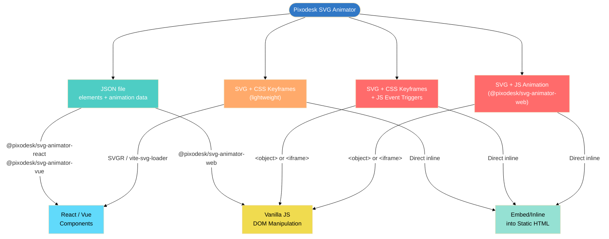

# pixodesk-svg-animator

[](https://github.com/pixodesk/pixodesk-svg-animator/actions/workflows/ci.yml)
[](https://opensource.org/licenses/MIT)

# 🚧 **Status - This project is currently under development.**


<!-- <video  src="boat.mp4" autoplay  muted loop playsinline style="width: 100%; height: auto; display: block;"></video> -->


This repository contains the official runtime libraries for playing SVG animations created with the [Pixodesk SVG Animation](https://pixodesk.com) editor.

**Common use cases:** 
- splash screens, 
- animated backgrounds, 
- icon animations, 
- loaders.


---

## File Formats created by [Pixodesk SVG Animation](https://pixodesk.com) editor

The Pixodesk editor supports animation in two formats: **SVG** and **JSON**.   
Those file formats are interchangeable — the editor can convert between them at any time.

## Pixodesk SVG Animator File Formats at a Glance

Two export formats:

- **JSON file** — the most flexible format. Animation data, structure, and metadata in a single file; JavaScript renders the DOM and drives the animation at runtime. Use with `@pixodesk/svg-animator-web`, `@pixodesk/svg-animator-react`, `@pixodesk/svg-animator-vue`.
- **SVG file** — a pre-rendered SVG with animation embedded directly in the file. Self-contained. Three flavors:
  - **SVG + CSS-Keyframes** — animation defined in a `<style>` block
    - *No `<script>` tag* — zero JavaScript
    - *With JS triggers* — adds a minimal `<script>` fragment to respond to events (click, hover, scroll)
  - **SVG + JavaScript animation** — `@pixodesk/svg-animator-web` bundled inside a `<script>` tag. Supports:
    - Web Animations API (WAAPI) — native browser animation
    - Animation frames (`requestAnimationFrame`) — universal browser support

---


```mermaid
%%{init: {'theme':'base', 'themeVariables': {'edgeLabelBackground':'white'}, 'flowchart':{'nodeSpacing': 100, 'rankSpacing': 80, 'curve': 'basis'}}}%%
graph TD
    App(["Pixodesk SVG Animator"])
    
    JSON["JSON file<br/>elements + animation data"]
    CSSkeyframes["SVG + CSS Keyframes<br/>(lightweight)"]
    CSSjs["SVG + CSS Keyframes<br/>+ JS Event Triggers"]
    JSanim["SVG + JS Animation<br/>(@pixodesk/svg-animator-web)"]
    
    ReactVue["React / Vue<br/>Components"]
    VanillaJS["Vanilla JS<br/>DOM Manipulation"]
    Embed["Embed/Inline<br/>into Static HTML"]

    App ---> JSON
    App ---> CSSkeyframes
    App ---> CSSjs
    App ---> JSanim

    JSON --->|"@pixodesk/svg-animator-react<br/>@pixodesk/svg-animator-vue"| ReactVue
    JSON --->|"@pixodesk/svg-animator-web"| VanillaJS

    CSSkeyframes --->|SVGR / vite-svg-loader| ReactVue
    CSSkeyframes --->|Direct inline| Embed

    CSSjs --->|&lt;object&gt; or &lt;iframe&gt;| VanillaJS
    CSSjs --->|Direct inline| Embed

    JSanim --->|&lt;object&gt; or &lt;iframe&gt;| VanillaJS
    JSanim --->|Direct inline| Embed
    
    style App fill:#3178c6,color:#fff
    style JSON fill:#4ecdc4,color:#fff
    style CSSkeyframes fill:#ffaa6b,color:#fff
    style CSSjs fill:#ff6b6b,color:#fff
    style JSanim fill:#ff6b6b,color:#fff
    style ReactVue fill:#61dafb,color:#000
    style VanillaJS fill:#f0db4f,color:#000
    style Embed fill:#95e1d3,color:#000
```


## How to Choose Pixodesk SVG Animator File Format - JSON vs SVG

**Default to JSON.** Switch to **SVG** (which has some limitations) when you want to:
- **Reduce bundle size** — use CSS Keyframes for simple animations; no JavaScript library needed
- **Show content before JavaScript loads for static site generators** — SVG is pre-rendered and visible immediately
- **Minimize setup** — just inline/embed the file directly without extra setup

**More details**:

- **React / Vue / Next.js / Nuxt**
  - Use **JSON** — **SSR-safe**, integrates cleanly with framework components, avoids inline script restrictions. Full support of animation features. Use `@pixodesk/svg-animator-react` / `@pixodesk/svg-animator-vue`.
  - Use **SVG + CSS-Keyframes** (no JavaScript) — minimal setup; import the same way as SVG icons (e.g., via **SVGR** or **vite-svg-loader**), and it is **SSR-safe**. It has limitations in what it can animate and offers less control over animation behavior. However, it is sufficient for most use cases.
- **Vanilla JavaScript/DOM**, dynamic load.
  - Use **JSON** — dynamically load and instantiate an animator using `@pixodesk/svg-animator-web`. Full support of animation features.
  - Use **SVG** — with `<object data="animation.svg" ...` or `<iframe src="animation.svg" ...`. Not recommended.
- **Static site generators and CMS** (Astro, Jekyll, WordPress, Shopify, etc.)
  - Use **any SVG** — the build tool or CMS inlines the file at build time; even SVG with `<script>` tags will just work


### Format pros and cons

| File type | When to use | Advantages | Disadvantages |
|-----------|-------------|------------|---------------|
| **JSON file** | Complex animations (shape morph, sequencing) <br> Programmatic control needed <br> Multiple instances on the page <br> React / Vue / Next.js / Nuxt apps | Full animation support including all types <br> Fine-grained runtime control: play, pause, seek, reverse, speed <br> Clean independent rendering per instance — no ID conflicts <br> SSR-safe | Requires `@pixodesk/svg-animator-react`, `-vue`, or `-web` runtime <br> More setup: data file and rendering component must be wired together |
| **SVG** with <br> **CSS Keyframes** | Drop-in animated icon in React/Vue <br> Embedding via `` or inline HTML <br> Simple looping or entrance animations | No library payload — minimal file size <br> No `<script>` tag — embeds cleanly via ``, inline HTML, or SVGR <br> Works as a drop-in icon replacement | No shape morphing or physics-based animations <br> No runtime control (play, pause, seek) <br> Limited to what CSS `@keyframes` can express <br> Possible ID conflicts when the same SVG is embedded more than once |
| **SVG** with <br> **CSS Keyframes + JS triggers** | Static HTML pages with event-triggered start/stop (e.g. play on hover) | No library payload — minimal file size <br> Adds basic event-driven start/stop control | No shape morphing or advanced animation types <br> No precise runtime control (seek, reverse, speed) <br> `<script>` tag prevents embedding via SVGR or `` <br> Possible ID conflicts when the same SVG is embedded more than once |
| **SVG** with <br> **JavaScript animation** | Static or server-rendered pages <br> When content must appear before JS hydration <br> All animation types without a separate data file | Supports all animation types including shape morphing <br> Full runtime control: play, pause, seek, reverse, speed <br> Self-contained — no separate data file required | Adds `@pixodesk/svg-animator-web` library overhead <br> `<script>` tag prevents embedding via SVGR or `` <br> Possible ID conflicts when the same SVG is embedded more than once |

---

## Animation Type Support

| Animation Type | CSS Keyframes | Web Animation API <br> (JavaScript) | Animation Frames <br> (JavaScript) |
|----------------|---------------|--------------------------------------|-------------------------------------|
| **Simple Numeric** (opacity, stroke-width) | ✅ Full support | ✅ Full support | ✅ Full support |
| **Position Attributes** (x, y, cx, cy, r, rx, ry) | ❌ Not supported `????` | ✅ Full support | ✅ Full support |
| **Size Attributes** (width, height) | ❌ Not supported `????` | ✅ Full support | ✅ Full support |
| **Transform** (translate, rotate, scale, skew) | ✅ Full support | ✅ Full support | ✅ Full support |
| **Colors** (fill, stroke) | ✅ Full support | ✅ Full support | ✅ Full support |
| **Path Morphing** (d attribute) | ❌ Not supported | ❌ Not supported | ✅ Full support |
| **Stroke Dash** (stroke-dasharray, stroke-dashoffset) | ✅ Basic support | ✅ Full support | ✅ Full support |
| **Gradient Stop Points** (offset, stop-color) | ⚠️ Limited `????` | ⚠️ Limited `????` | ✅ Full support |
| **Filters** (blur, brightness, etc.) | ⚠️ Simple only `????` | ✅ Most filters | ✅ Full support |
| **Clip-path / Mask Morphing** | ❌ Not supported `????` | ❌ Not supported `????` | ✅ Full support |
| **Text on Path** (startOffset, textPath) | ⚠️ Limited `????` | ✅ Full support | ✅ Full support |
| **Performance** | ⚡ Excellent | ⚡ Excellent | ⚠️ Good |
| **Browser Support** | ✅ Universal | ✅ Modern browsers | ✅ Universal |


---


## File formats


#### JSON format schema reference

```typescript
// PxPropertyAnimation — single-property animation
// short aliases: kfs=keyframes; t=time, v=value, e=easing on each keyframe
interface ANIMATE {
    keyframes?: Array<{
        time?: number;    // ms offset from animation start; alias: t
        value?: any;      // value at this keyframe (number, string, [x,y], path…); alias: v
        easing?: string | [number, number, number, number]; // named ref or cubic-bezier [x1,y1,x2,y2]; alias: e
    }>;
    // pre-processes keyframes to fill animator.duration by repeating a segment
    // true → default: repeat last segment, cycling forward
    // independent of animator.iterations; composes as loop-within-loop
    loop?: boolean | {
        segmentCount?: number; // intervals forming the segment; undefined = whole sequence; clamped [1, n-1]
        before?: boolean;      // false (default) = loop end (idle/outro); true = loop start (intro)
        alternate?: boolean;   // false (default) = cycle same direction; true = pingpong
    };
}
```

```typescript
// PxAnimatedSvgDocument
// Mode A: has children — player renders SVG tree and animates it
// Mode B: no children — player animates a pre-existing SVG DOM via animator.animate
interface SVG_JSON {
    type: 'svg';        // document root marker
    id?: string;        // DOM id; in Mode B used to locate the pre-rendered element
    viewBox?: string;   // internal coordinate space, e.g. "0 0 700 380"
    width?: number;     // rendered size; width accepts CSS units
    height?: number;
    [key: string]: any; // any SVG/CSS presentation attribute; pass-through to DOM

    animator?: {
        delay?: number;                    // delay before start, ms
        duration?: number;                 // total timeline length, ms; keyframe t values are absolute offsets
        iterations?: number | 'infinite'; // repeat count; composes with per-property loop (loop-within-loop)
        fill?: 'forwards' | 'backwards' | 'both' | 'none'; // WAAPI fill; default 'forwards' holds final state
        direction?: 'normal' | 'reverse' | 'alternate' | 'alternate-reverse';
        mode?: 'auto' | 'webapi' | 'frames'; // 'auto' = WAAPI→RAF fallback; 'webapi' = WAAPI; 'frames' = RAF
        frameRate?: number;                // target fps; RAF mode only

        trigger?: {
            startOn?: 'load' | 'mouseOver' | 'click' | 'scrollIntoView' | 'programmatic';
            outAction?: 'continue' | 'pause' | 'reset' | 'reverse';
            scrollIntoViewThreshold?: number; // visibility fraction (0–1); scrollIntoView only
        };

        // named reusable easings and animations; resolved at runtime
        // materialise (inline) all refs before handing to a dumb player
        definitions?: {
            easings?: Record<string, [number, number, number, number]>; // name → [x1,y1,x2,y2]
            animations?: Record<string, Record<string, ANIMATE>>;       // name → { propName: ANIMATE }
        };

        // Mode B — maps elementId → animation spec
        // value: named ref / array of refs / inline definition / mixed array
        animate?: Record<string,
            | string
            | Array<string>
            | Record<string, ANIMATE>
            | Array<string | Record<string, ANIMATE>>
        >;
    };

    // Mode A — SVG element tree; absence of children signals Mode B
    children?: Array<{
        type: string;       // SVG element tag: "rect", "g", "path", "ellipse", "use", …
        id?: string;        // DOM id; required for href="#id" refs or animator.animate targeting
        [key: string]: any; // SVG/CSS attrs (cx, cy, r, fill, stroke, transform, …); pass-through
        style?: string | Record<string, string | number>;
        // named ref / array of refs / inline definition / mixed array
        animate?: string | Array<string> | Record<string, ANIMATE> | Array<string | Record<string, ANIMATE>>;
        meta?: any;         // editor-only (label, shape, …); not rendered, ignored by player
        children?: Array<any>; // recursive; <g>, <defs>, <symbol>, <text>, <use>, …
    }>;
}
```

### JSON File format example

A JSON document that mirrors SVG structure. The player constructs the SVG DOM and drives the animation at runtime. All animation data, structure, and metadata live in one file.

Two modes share the same root document type (`PxAnimatedSvgDocument`):
- **Mode A** — `children` present: player renders the element tree and animates it.
- **Mode B** — no `children`: player animates a pre-existing SVG DOM via `animator.animate`.

**Quick example:**

```json
{
  "type": "svg",
  "viewBox": "0 0 400 400",
  "animator": {
    "duration": 1000,
    "iterations": "infinite",
    "mode": "auto",
    "trigger": { "startOn": "load" }
  },
  "children": [
    {
      "type": "ellipse",
      "fill": "#007fff85",
      "stroke": "#003a73",
      "rx": 64, "ry": 64,
      "animate": {
        "translate": {
          "keyframes": [
            { "t": 0,    "v": [139, 163] },
            { "t": 1000, "v": [139, 310] }
          ]
        }
      }
    }
  ]
}
```

#### Full example — Mode A (all animation types)

```typescript
const doc = {
    type: 'svg',
    id: '_px_root',
    viewBox: '0 0 600 400',

    animator: {
        duration: 2000,
        iterations: 'infinite',
        fill: 'forwards',
        direction: 'alternate',
        mode: 'auto',
        trigger: { startOn: 'load', outAction: 'pause' },
        definitions: {
            easings: {
                smooth: [0.42, 0, 0.58, 1],  // name → [x1,y1,x2,y2]
            },
            animations: {
                fadeIn: { opacity: { keyframes: [{ t: 0, v: 0 }, { t: 2000, v: 1 }] } },
            },
        },
    },

    children: [

        // opacity — number; named ref from definitions.animations
        {
            type: 'rect',
            x: 40, y: 40, width: 120, height: 90, rx: 8, fill: '#6366f1',
            animate: 'fadeIn',
        },

        // fill — color; inline keyframes with named easing ref
        {
            type: 'ellipse',
            cx: 260, cy: 95, rx: 80, ry: 55, fill: '#3b82f6',
            animate: {
                fill: {
                    keyframes: [
                        { t: 0,    v: '#3b82f6' },
                        { t: 2000, v: '#ec4899', e: 'smooth' },
                    ],
                },
            },
        },

        // translate + scale + rotate
        // one CSS transform fn per nesting level — compose by nesting, not by listing
        {
            type: 'g',
            animate: { translate: { keyframes: [{ t: 0, v: [460, 90] }, { t: 2000, v: [540, 90] }] } },
            children: [{
                type: 'g',
                animate: {
                    scale: {
                        keyframes: [
                            { t: 0,    v: [1,   1  ] },
                            { t: 1000, v: [1.3, 1.3] },
                            { t: 2000, v: [1,   1  ] },
                        ],
                        loop: true,  // repeat last segment to fill animator.duration
                    },
                },
                children: [{
                    type: 'g',
                    animate: {
                        rotate: {
                            keyframes: [{ t: 0, v: 0 }, { t: 1000, v: 360 }],
                            loop: { segmentCount: 1, before: false, alternate: false },
                        },
                    },
                    children: [{ type: 'rect', x: -22, y: -22, width: 44, height: 44, fill: '#10b981' }],
                }],
            }],
        },

        // path morph — animate 'd'; both values must have identical command structure
        {
            type: 'path',
            fill: '#f59e0b',
            transform: 'translate(120, 280)',
            animate: {
                d: {
                    keyframes: [
                        { t: 0,    v: 'M-50,0 L0,-50 L50,0 L0,50 Z'       },
                        { t: 2000, v: 'M-50,-50 L50,-50 L50,50 L-50,50 Z' },
                    ],
                },
            },
        },

        // stroke-dasharray — draw-on effect; v is [dash, gap]
        {
            type: 'path',
            stroke: '#ef4444', 'stroke-width': 3, fill: 'none',
            d: 'M 240 260 C 320 180 400 340 480 260',
            animate: {
                'stroke-dasharray': {
                    keyframes: [
                        { t: 0,    v: [0,   300] },
                        { t: 2000, v: [300, 300] },
                    ],
                },
            },
        },
    ],
};
```


### SVG File overview

A self-contained animated SVG — all shapes, styles, and animation logic are embedded directly in the file. No separate data file or rendering component is needed. Three flavors are available:

#### **CSS Keyframes**

Animation defined in a `<style>` block. No JavaScript, no `<script>` tag.

```svg
<svg xmlns="http://www.w3.org/2000/svg" viewBox="...">
  <style>
    @keyframes _px_2s602utm {
      0% { transform: translate(200.1185px, 41.3612px); }
      100% { transform: translate(200.1185px, 41.3612px); }
    }
  </style>
  <g class="px-anim-element _px_2s602utn" transform="...">
    <ellipse id="_px_2s602utl" fill="#0087ff" ... />
  </g>
</svg>
```

#### **CSS Keyframes + JavaScript triggers** 
Same as above, plus a small `<script>` fragment to start/stop the animation on events (click, hover, scroll).

```svg
<svg xmlns="http://www.w3.org/2000/svg" viewBox="...">
  <style>@keyframes ... { ... }</style>
  <g class="px-anim-element ...">...</g>
  <script data-px-script="true">
    /* Small fragment to control animation on events */
  </script>
</svg>
```

#### **SVG + JavaScript animation (Mode B)**

Static SVG markup with `@pixodesk/svg-animator-web` bundled in a `<script>` tag. The player targets existing DOM elements by `id`. Supports all animation types including shape morphing. Uses WAAPI or `requestAnimationFrame`.

The `data` object passed to `createAnimator` is the same `PxAnimatedSvgDocument` type as the JSON format — without `children`. All animation config lives in `animator.definitions` (named easings and animations) and `animator.animate` (element ID → animation spec map).

```xml
<!-- static markup; player targets elements by id -->
<svg id="_px_root" xmlns="http://www.w3.org/2000/svg" viewBox="0 0 600 400">

  <!-- opacity; starts transparent, animated to visible -->
  <rect id="_px_rect" x="30" y="30" width="120" height="80"
        rx="8" fill="#6366f1" opacity="0" />

  <!-- fill color + slide-in from left -->
  <ellipse id="_px_ellipse" cx="260" cy="70" rx="80" ry="50" fill="#3b82f6" />

  <!-- scale loop + translate; children at origin so scale-origin is correct -->
  <g id="_px_group" transform="translate(90,260)">
    <rect x="-40" y="-30" width="80" height="60" rx="6" fill="#a855f7" />
  </g>

  <!-- rotate loop; transform-box ensures rotation around own center -->
  <g id="_px_icon" transform="translate(260,260)"
     style="transform-box:fill-box;transform-origin:center">
    <rect x="-25" y="-25" width="50" height="50" rx="4" fill="#10b981" />
  </g>

  <!-- path morph; same command count/structure in both keyframe values -->
  <path id="_px_morph" fill="#ec4899" transform="translate(420,260)"
        d="M-50,0 L0,-50 L50,0 L0,50 Z" />

  <!-- draw-on; starts hidden via stroke-dasharray -->
  <path id="_px_path" stroke="#ef4444" stroke-width="3" fill="none"
        stroke-dasharray="0 300"
        d="M 30 360 C 130 290 230 420 330 350 C 430 280 530 390 570 340" />

  <script data-px-script="true">
    var a = PixodeskAnimator.createAnimator({ data: {
        type: 'svg',
        id: '_px_root',
        animator: {
            duration: 2000,
            iterations: 'infinite',
            fill: 'forwards',
            mode: 'auto',
            trigger: { startOn: 'load', outAction: 'pause' },
            definitions: {
                easings: {
                    smooth: [0.42, 0, 0.58, 1],
                },
                animations: {
                    fadeIn:     { opacity:            { keyframes: [{ t: 0, v: 0 }, { t: 2000, v: 1 }] } },
                    colorShift: { fill:               { keyframes: [{ t: 0, v: '#3b82f6' }, { t: 2000, v: '#ec4899', e: 'smooth' }] } },
                    slideIn:    { translate:          { keyframes: [{ t: 0, v: [-80, 0] }, { t: 2000, v: [0, 0] }] } },
                    pulse:      { scale:              { keyframes: [{ t: 0, v: [1, 1] }, { t: 1000, v: [1.2, 1.2] }, { t: 2000, v: [1, 1] }], loop: true } },
                    spin:       { rotate:             { keyframes: [{ t: 0, v: 0 }, { t: 1000, v: 360 }], loop: { segmentCount: 1, before: false, alternate: false } } },
                    morph:      { d:                  { keyframes: [{ t: 0, v: 'M-50,0 L0,-50 L50,0 L0,50 Z' }, { t: 2000, v: 'M-50,-50 L50,-50 L50,50 L-50,50 Z' }] } },
                    draw:       { 'stroke-dasharray': { keyframes: [{ t: 0, v: [0, 300] }, { t: 2000, v: [300, 300] }] } },
                },
            },
            animate: {
                _px_rect:    'fadeIn',                   // single named ref
                _px_ellipse: ['colorShift', 'slideIn'],  // array of refs
                _px_group:   ['pulse', { translate: { keyframes: [{ t: 0, v: [0, 0] }, { t: 2000, v: [40, 0] }] } }], // mixed
                _px_icon:    'spin',
                _px_morph:   'morph',
                _px_path:    'draw',
            },
        },
    }});
  </script>
</svg>
```

---


## Using in React / Next.js

SVG files are self-contained and can be embedded in a few ways:

- **Copy-paste** — paste SVG markup directly into HTML
- **Inlined/embedded** - into static HTML by your framework, CMS or static site generator
- **`<object>` / `<iframe>`** — reference the `.svg` file by URL (animation runs in isolation)
- **Framework import** — let the build tool inline the SVG at build time (see below)

### React / Next.js

**CSS Keyframes SVG** — import as a component via [SVGR](https://react-svgr.com/), the same way you import an icon:

```tsx
// requires @svgr/webpack or @svgr/vite
import Animation from './animation.svg';
<Animation />
```

**SVG with `<script>`** — SVGR strips `<script>` tags by default. Use `dangerouslySetInnerHTML` or a raw HTML approach, or switch to JSON instead.

**JSON:**

```tsx
import { PixodeskSvgAnimator } from '@pixodesk/svg-animator-react';
import animation from './animation.json';

export default function App() {
  return <PixodeskSvgAnimator doc={animation} autoplay />;
}
```

## Using in Vue / Nuxt

**CSS Keyframes SVG:**

```vue
<component :is="require('./animation.svg?inline')" />
```

**JSON:**

```vue
<template>
  <PixodeskSvgAnimator :doc="animation" autoplay />
</template>

<script setup>
import { PixodeskSvgAnimator } from '@pixodesk/svg-animator-vue';
import animation from './animation.json';
</script>
```

## Vanilla JavaScript / DOM

**Package:** `@pixodesk/svg-animator-web`

**Option 1: Data attribute (auto-load)**

```html
<div data-px-animation-src="/animation.json"></div>
<script src="pixodesk-svg-animator.umd.js"></script>
<script>
  PixodeskAnimator.loadTagAnimators();
</script>
```

**Option 2: Programmatic**

```js
import { createAnimator } from '@pixodesk/svg-animator-web';

const animator = createAnimator('/animation.json', undefined, {
  onFinish: () => console.log('done'),
}, '#container');

animator.play();
animator.pause();
animator.setCurrentTime(500); // seek to 500ms
animator.setPlaybackRate(2);  // 2× speed
animator.destroy();           // cleanup
```

## Build-time inline into static HTML

### 1) Static site generators

| Framework | Code |
|-----------|------|
| **Astro** | `import svg from './animation.svg?raw';` <br> `<Fragment set:html={svg} />` |
| **SvelteKit** | `{@html await import('./animation.svg?raw')}` |
| **Angular** | `import svg from './animation.svg?raw';` <br> `<div [innerHTML]="svg"></div>` |
| **Jekyll** | `` |
| **Gatsby** | `` |
| **11ty (Eleventy)** | `` |

### 2) CMS and Website Builders

Paste the SVG content via an HTML code block or code injection widget provided by the platform:

| Platform | Method |
|----------|--------|
| **WordPress** | `<?php echo file_get_contents(get_template_directory() . '/assets/animation.svg'); ?>` |
| **Shopify** | Add via a Liquid snippet or Theme code editor |
| **Webflow** | Embed component → paste SVG markup |
| **Squarespace** | Code block → paste SVG markup |
| **Wix** | HTML iframe element → paste SVG markup |


## Packages

| Package | Description |
|---------|-------------|
| **[@pixodesk/svg-animator-web](packages/svg-animator-web/README.md)** | Core web player — renders JSON animations in the browser via the Web Animations API or `requestAnimationFrame`. Ships as ESM, CJS, and UMD. |
| **[@pixodesk/svg-animator-react](packages/svg-animator-react/README.md)** | React component — SSR-safe wrapper around the web player |
| **[@pixodesk/svg-animator-vue](packages/svg-animator-vue/README.md)** | Vue component — SSR-safe wrapper around the web player |

## Examples

Examples in [`examples/`](examples/):

| Example | Package |
|---------|---------|
| [web](examples/web/) | `@pixodesk/svg-animator-web` |
| [react](examples/react/) | `@pixodesk/svg-animator-react` |
| [vue](examples/vue/) | `@pixodesk/svg-animator-vue` |

## Live Examples

TODO

## License

[MIT](LICENSE) © [Pixodesk](https://pixodesk.com)